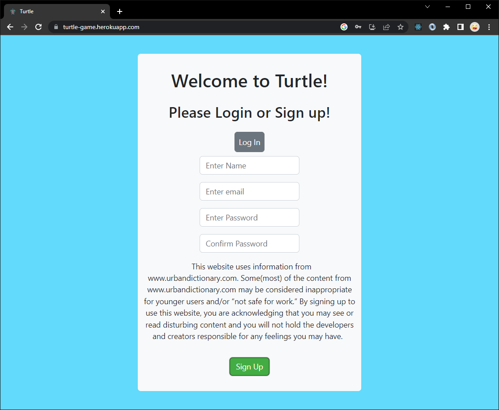
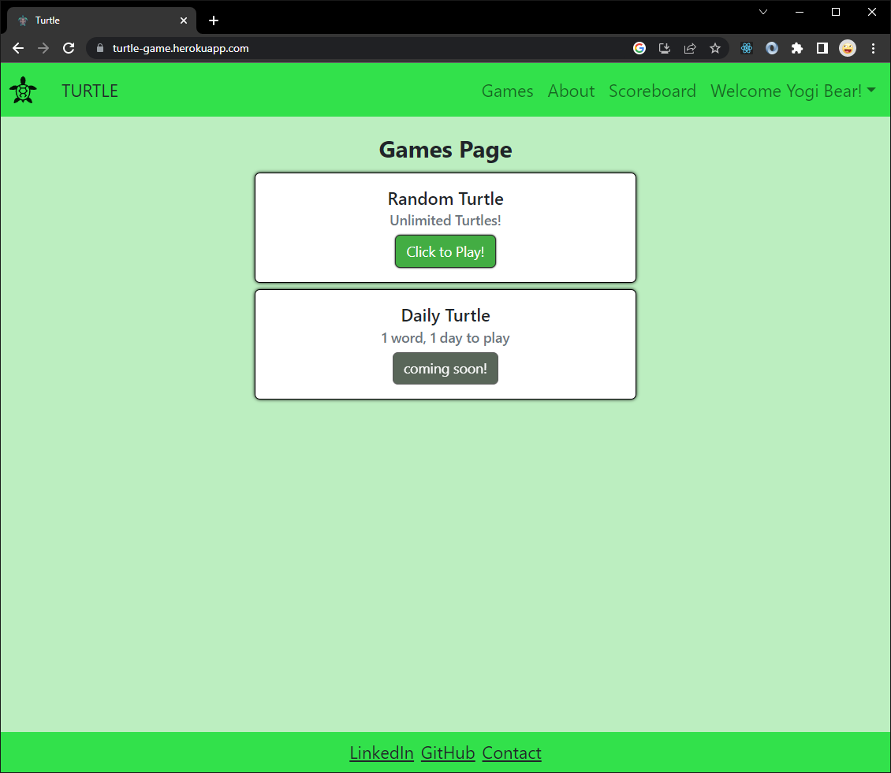
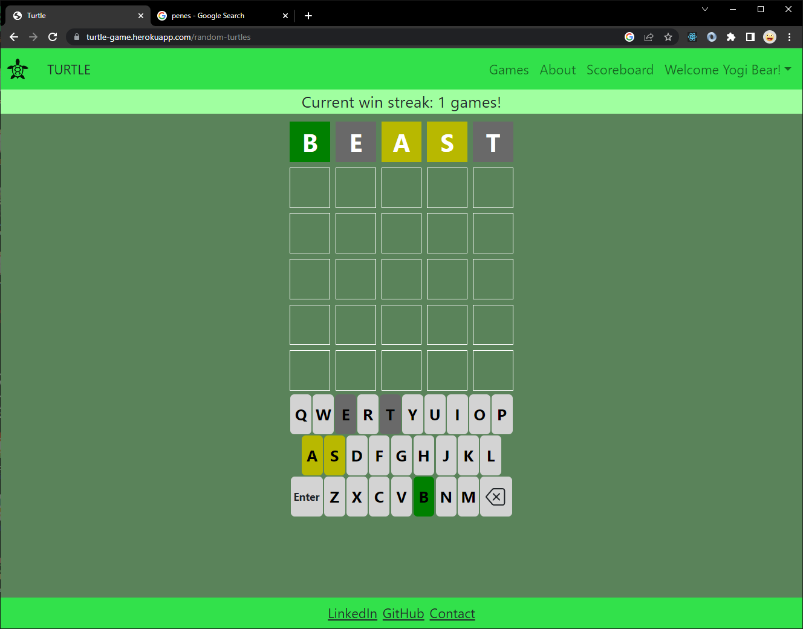
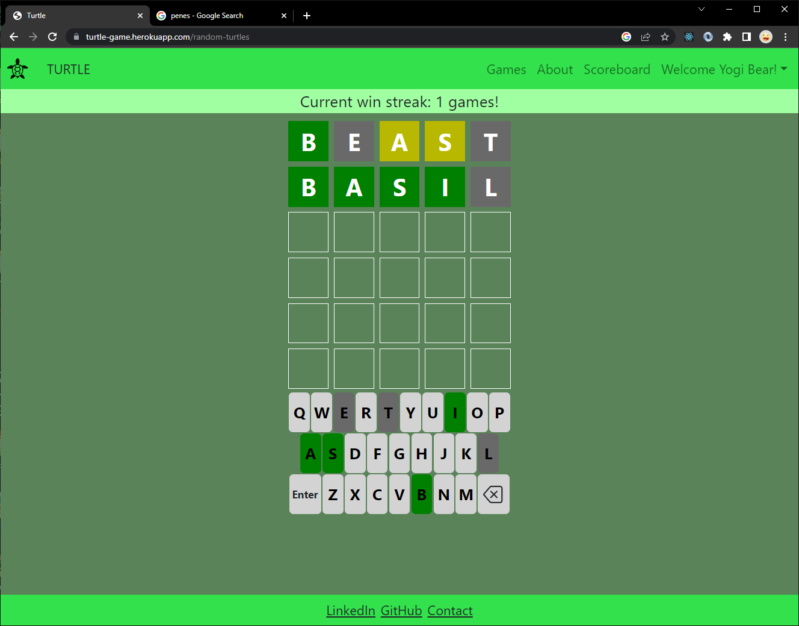
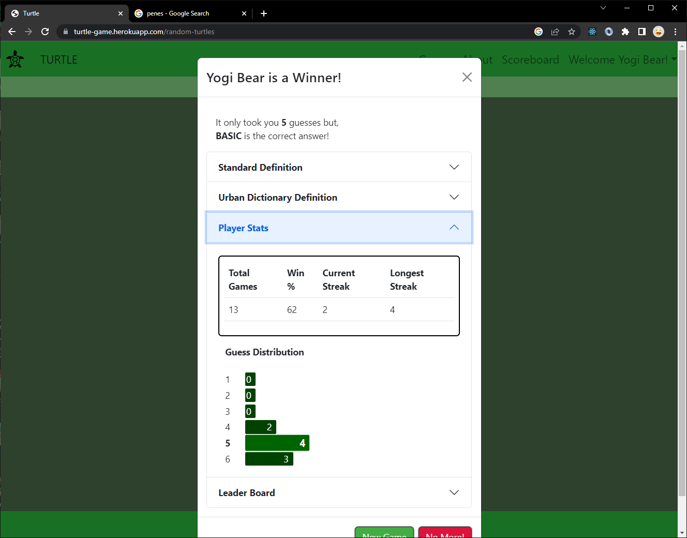
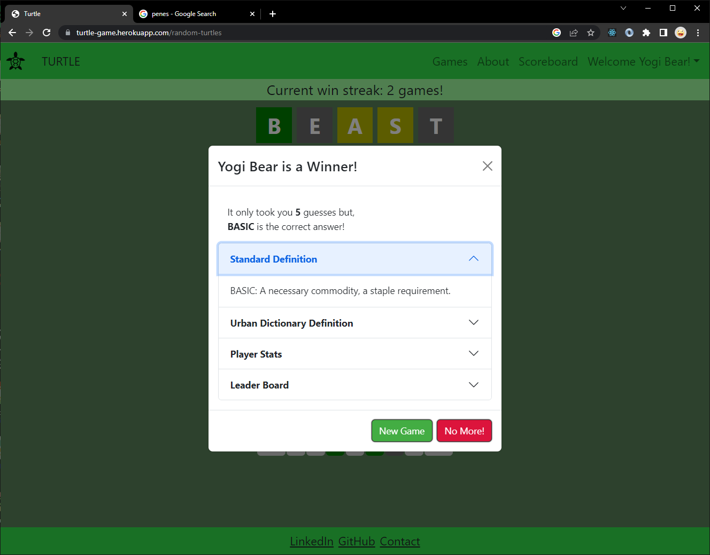
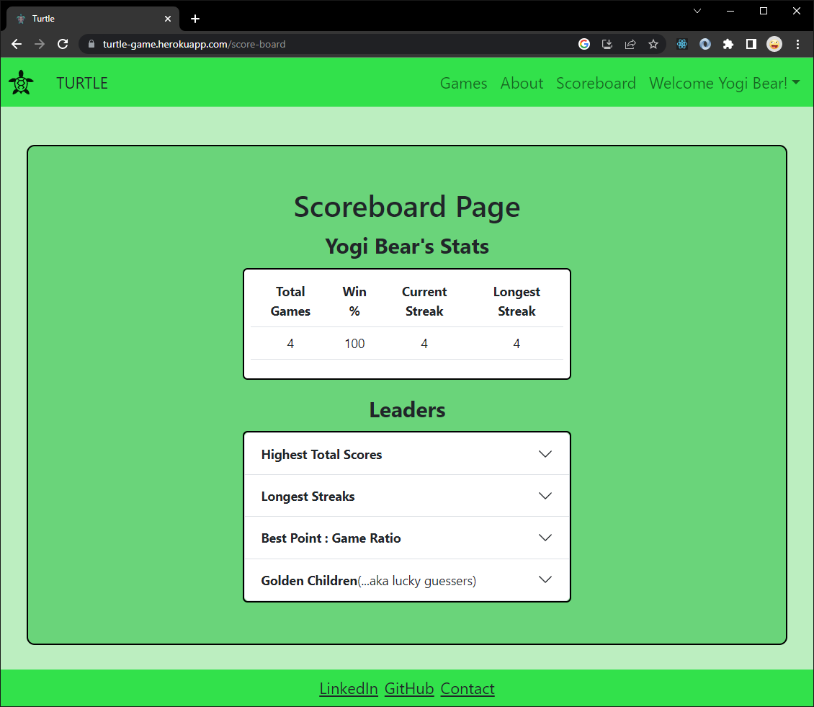

# Welcome to Turtle

## [Link to deployed app](https://turtle-game.herokuapp.com/)

### Demo account info:

email: demo@demo.com 
password: 123 
(feel free to make your own account and join in on the fun!)

## What is and why Turtle?

Turtle is a re-creation and adaptation of the well known game "Wordle." As an avid player and fan of Wordle, I play the New York Times' word game daily with a group of friends and we all share our scores with each other. Along with my friends, we often find ourselves wanting to play more than one game a day, and also at times, need to look up the meaning of the resulting answer. To satisfy these wants, I recreated Wordle with a few unique distinctions.

## Daily Game vs. Unlimited Games

Traditional Wordle offers 1 game per day, with puzzle answers already determined and hard coded into the game. Turtle currently features unlimited plays as well as providing random puzzle answers for each game. (more on how puzzle answers are selected in the 'how it works sections')

## Local Storage vs. Database Storage

Turtle is a full stack PERN(PostgreSQL, Express, React, Node) application that stores all user's game results and statistics to a relational database. As such, Turtle is able to query the database to display other players scores and stats.

## Answer Defintions

When a game is either won or loss, the player has a choice to show a standard definition (assumed 'safe for work') from dictionaryapi.dev or a definition from urbandictionary.com('not safe for work')

## How it works

When a new game is started, a few things happen to select a random word. First, a random word is generated by making a request to the Urban Dictionary(UD) API. The API request returns a short list of randomly selected words of varying length and their definitions from the UD. This list is passed through a script to find the first 5 letter word. If there is no 5 letter word, another request is made to the API and a new random list of words is returned.

Once a 5 letter word is found, a new API request is made to dictionaryapi.dev to ensure that the word from UD is an acceptable, english language word. If unacceptable, it returns an error message and the process starts again. If the word is acceptable, the request returns a “safe-for-work” definition of the word to be displayed along with its UD definition after the game is completed.

## How to Play

You have 6 attempts to:

- Enter a valid 5 letter word
- if a letter is in the correct spot, its background will turn green
- if a letter is in the word, but not in the correct spot, its background will turn yellow.
- if a letter in not in the word, its background will turn grey.

## Screen Shots

## Technologies Used

PostgreSQL, Express.js, React.js, Node.js HTML5, CSS3, JavaScript ES6, Bootstrap, Sequelize, Token-Based Authentication(JWT)

## [Link to deployed app](https://turtle-game.herokuapp.com/)

### Demo account info:

email: demo@demo.com 
password: 123 
(feel free to make your own account and join in on the fun!)

This project was bootstrapped with [Create React App](https://github.com/facebook/create-react-app).
